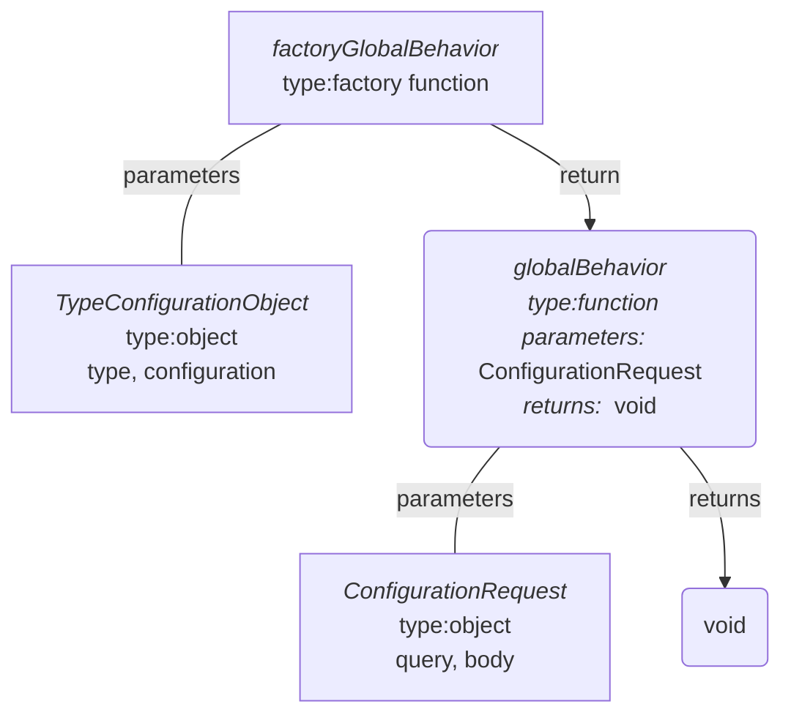

```mermaid
graph TB;

factoryGlobalBehavior[<em>factoryGlobalBehavior</em><br>type:factory function]

TypeConfigurationObject[<em>TypeConfigurationObject</em><br>type:object<br>type, configuration]

returnFunction(<em>globalBehavior<br> type:function</em><br><em>parameters: </em> ConfigurationRequest<br><em>returns: </em> void)

ConfigurationRequest[<em>ConfigurationRequest</em><br>type:object<br>query, body]

returnFunction--parameters---ConfigurationRequest
returnFunction--returns-->void(void)

factoryGlobalBehavior--parameters---TypeConfigurationObject
factoryGlobalBehavior--return-->returnFunction

```