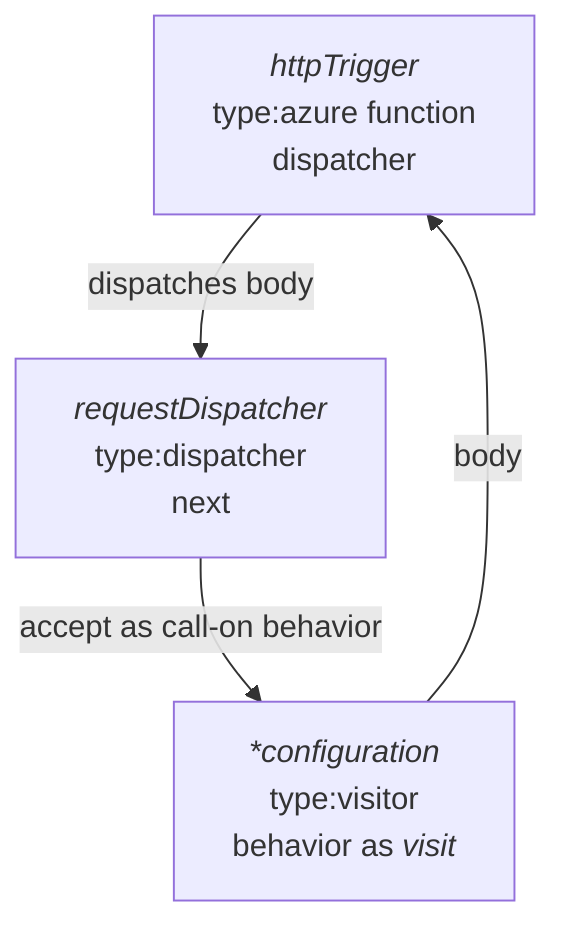

```mermaid
graph TB;
    httpTrigger[<em>httpTrigger</em><br>type:azure function<br>dispatcher] 
    
    --dispatches body-->
    
    requestDispatcher[<em>requestDispatcher</em><br>  type:dispatcher<br>next]
    
    --accept as call-on behavior-->
    
    configuration[<em>*configuration</em><br>type:visitor<br>behavior as <em>visit</em>]

    --body-->httpTrigger
```