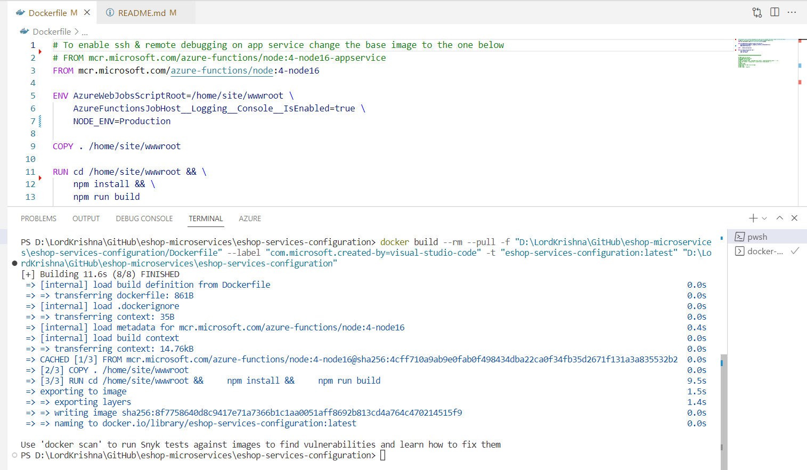
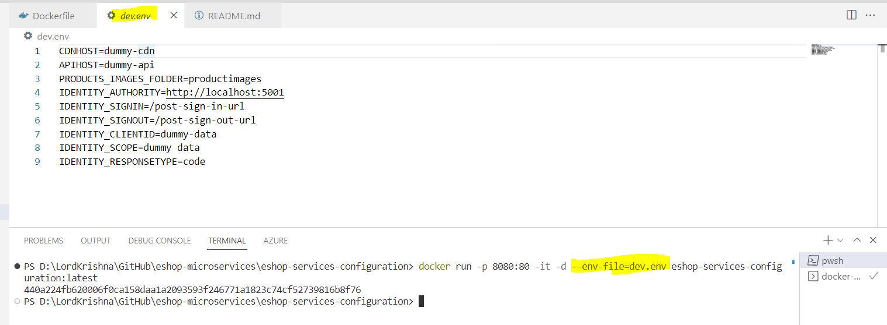
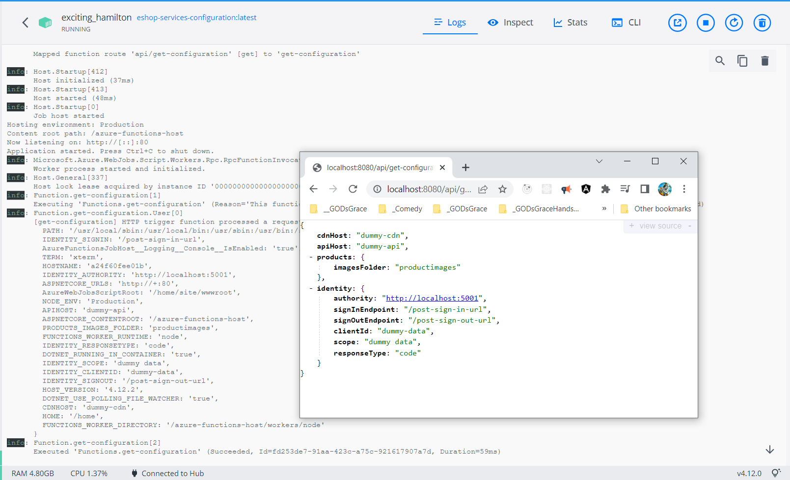

# eShop Services Configuration

This repository holds the Configuration Micro Services

## Build Docker Image for Configuration Micro Service

```bash
docker build --rm --pull -f "D:\LordKrishna\GitHub\eshop-microservices\eshop-services-configuration/Dockerfile" --label "com.microsoft.created-by=visual-studio-code" -t "eshop-services-configuration:latest" "D:\LordKrishna\GitHub\eshop-microservices\eshop-services-configuration"
```

### Run Docker Image



## Run Docker Container for Configuration Micro Service

```bash
docker run -p 8080:80 -it -d --env-file=dev.env eshop-services-configuration:latest
```

### Run Docker Container



## Retrieve Configuration Values

Browse to <http://localhost:8080/api/configuration> to retrieve the configuration values

### Get Configuration Values



---

## wishlist

- CI/CD
- Deploy to Azure Kubernetes Service
- swagger
- add to postman collection
