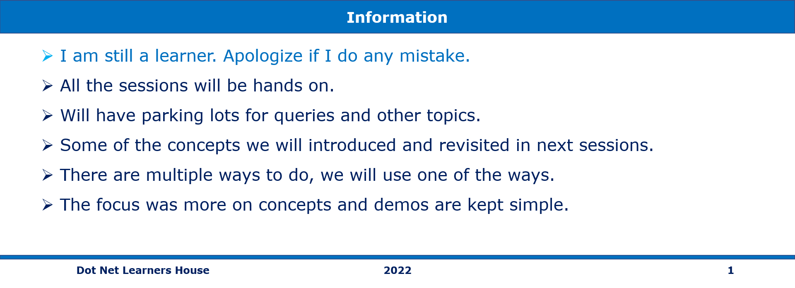
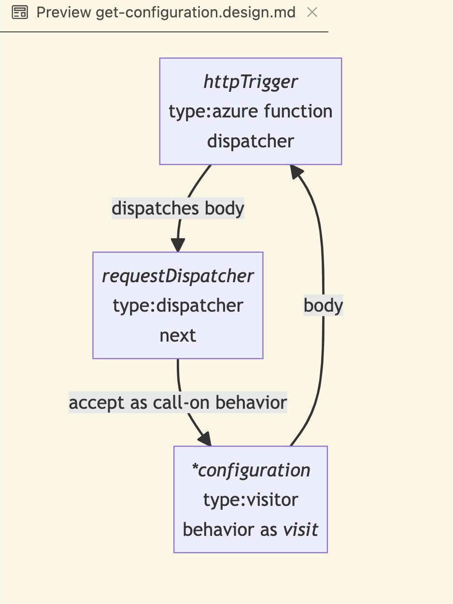
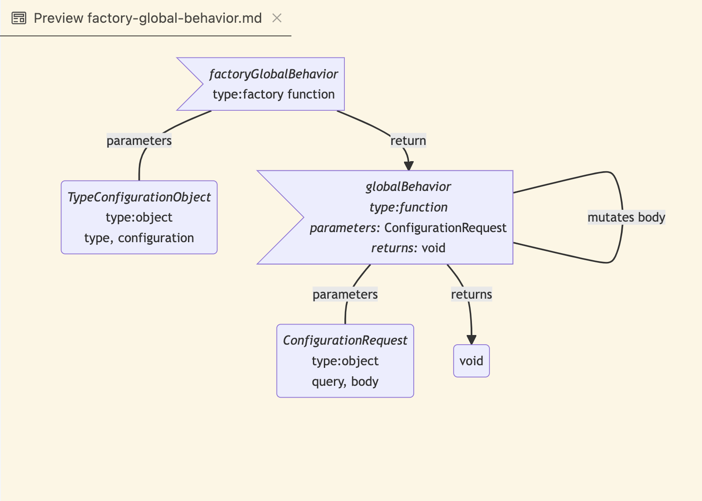

# eShop Configuration Microservices

This repository holds the Configuration Microservices

## Status Badges

| PR, and CI Builds | Code QL |
| ---------------------------------------------------------------------------------------------------------------------------------------------------------------------------------------------------------------------------------- | ------------------------------------------------------------------------------------------------------------------------------------------------------------------------------------------------------------------------- |
| To be done | To be done |

## Pre-Requisites

> 1. Windows 10 / Ubuntu 20.04 / Mac OS 12.3 (build 21E230)
> 1. NPM
> 1. Angular CLI
> 1. VS Code (<https://code.visualstudio.com/>)
> 1. Docker Desktop (<https://docs.docker.com/docker-for-windows/install/>)
> 1. PowerShell 7+

---

## Links to individual session(s) Documentation and its Videos

**Note:**: The links below are to the individual session(s) documentation and its videos.

> 1. Please refer [**eshop-main**](https://github.com/vishipayyallore/eshop-main/blob/main/README.md) for the links to individual session(s) documentation and its videos for the entire series.
> 1. Please refer [Session**1**.md](./Documentation/Sessions/Session1.md) and [Video](https://www.youtube.com/watch?v=ckWZIZVDBjI) for more details.



## What are we going to do today?

> 1. Greetings/Introduction Reel (`5 Minutes`)
> 1. Introduction `Configuration Service` (`15 Minutes`)
> 1. Architecture Overview of `Configuration Service` (`25 Minutes`)
>     - Software Design (`15 Minutes`)
>     - System Design (`10 Minutes`)
> 1. Hands-on `Configuration Service` locally (`10 Minutes`)
> 1. Review/Q & A/Panel Discussion (`5 Minutes`)
> 1. What is next in `Session 16`? (`5 Minutes`)


## 1. Greetings/Introduction Reel (`5 Minutes`)

> 1. Greetings

## 2. Introduction `Configuration Service` (`15 Minutes`)

> 1. Why is it needed? (`5 Minutes`)

A winning pattern in web architecture is to have backend specialists with the frontend team, who design optimized endpoints for the frontend. This can be called _backend for frontend_ (BFF), or _vertical slices_ or _vertical integration_, etc. The location where these endpoints are mounted within the api may not be resolved right away, or may change, and often times there is an api gateway prooject where such decisions are made which is a completely separate project. To ensure that these projects can make their changes without needing to update code in various front end projects, we can advise frontend projects to use a configuration service to render the endpoints to the front end, rather than hardcoding these urls.

### resources
- [Should frontend developers define endpoint APIs?](https://vaadin.com/blog/should-frontend-developers-define-endpoint-apis) Vaadin
- [A Deep Dive into the Back-End for Front-End Pattern](https://www.codemag.com/Article/2203081/A-Deep-Dive-into-the-Back-End-for-Front-End-Pattern) CODE Magazine
- [Vertical AND Horizontal Slices in Agile Software Development](https://medium.com/@timkleier/vertical-and-horizontal-slices-45b7d435ac35) Medium

> 2. What is a `Configuration Service`? (`5 Minutes`)

So a configuration service then needs to render relevant information for accessing an api to the front end. Usually this will be one or more trees of data in json format. It is vital that it be easily extensible, and simple to modify the values that it serves.

Especially while multiple endpoints are required (before complting an api gatway), we want to be able to populate the endpoint from data resulting from deployments, such as from kubernetes.

> 3. What should the payload look like from `Configuration Service`? (`5 Minutes`)

One approach is to allow query parameters to specify which service you want metadata on. Otherwise, a default tree of data should be rendered. Each endpoint can specify its data under a reserved key. These keys are safe to hard code into the project, as they will not be modified with any frequency without a corresponding frontend project.

## 3. Architecture Overview of `Configuration Service` (`25 Minutes`)

> 1. Demo and Discussion

### 3.1. Software Design (`15 Minutes`)

> 1. Simple Serverless Function (`5 Minutes`)
>     - In order to simplify design
>     - Enabled by a reliance on environment variables

argue that we only need an azure function since we ar only supporting one endpoint and query parameters.

> 2. How do we make the SDLC of this pattern work? (`10 Minutes`)
>     - Dispatcher Pattern
>     - Visitor Pattern



>     - Factory Pattern




### 3.2. System Design (`10 Minutes`)

> 1. How to populate `Environment Variables` (`5 Minutes`)
>     - how to gather environment variables
>     - how to expose environment variables
> 1. How to update running script with `Environment Variables` (`5 Minutes`)
>     - Alternative Approaches
>       - Database (too complicated!)
>       - Caching store (too complicated!)

## 4. Hands-on `Configuration Service` locally (`10 Minutes`)

> 1. Demonstrate in Postman
> 1. Demonstrate on Commandline

---

## 5. Review/Q & A/Panel Discussion (`5 Minutes`)

> 1. Discussion

## 6. What is next in Session `16`? (`5 Minutes`) on `17-Feb-2023`

> 1. To be done
> 1. Review/Q & A/Panel Discussion (`5 Minutes`)
> 1. What is next in `Session 17`? (`5 Minutes`)

---

## wishlist

- CI/CD
- Deploy to Azure Kubernetes Service
- swagger
- add to postman collection

---

## Build Docker Image for Configuration Micro Service

```bash
docker build --rm --pull -f "D:\LordKrishna\GitHub\eshop-microservices\eshop-services-configuration/Dockerfile" --label "com.microsoft.created-by=visual-studio-code" -t "eshop-services-configuration:latest" "D:\LordKrishna\GitHub\eshop-microservices\eshop-services-configuration"
```

### Run Docker Image


## Run Docker Container for Configuration Micro Service

```bash
docker run -p 8080:80 -it -d --env-file=dev.env eshop-services-configuration:latest
```

### Run Docker Container


## Retrieve Configuration Values

Browse to <http://localhost:8080/api/configuration> to retrieve the configuration values

### Get Configuration Values


